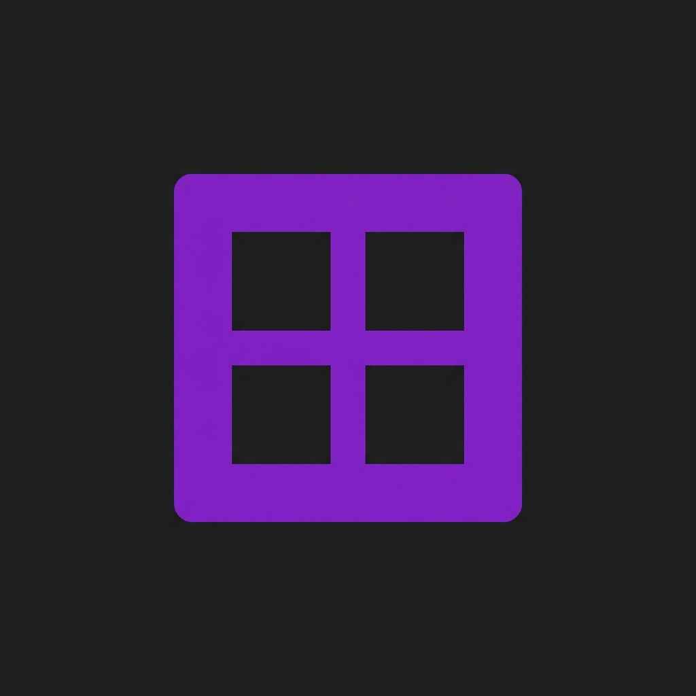

# 🌌 Cristalix Offline Launcher

<p align="center">
  
</p>

<p align="center">
  <strong>Современный оффлайн-лаунчер Minecraft с поддержкой сборки модов Cristalix, динамической кастомизацией меню и изолированным запуском инстансов.</strong>
</p>

---

## ✨ Особенности лаунчера

* 🪟 **Glassmorphism UI:** Минималистичный и премиальный пользовательский интерфейс с эффектом размытия стекла и плавными анимациями WebGL.
* 📦 **Изолированный запуск:** Каждая сборка запускается в своей собственной изолированной директории (свои папки `mods`, `config`, `saves` и `options.txt`), что предотвращает конфликты версий.
* 🌐 **Импорт сборок в 1 клик:** Возможность импортировать готовые сборки модов из `.zip` архивов (или файлов `.mrpack` от Modrinth) напрямую через интерфейс каталога.
* ⚡ **Автоопределение сборок:** Лаунчер автоматически определяет версию Minecraft и тип загрузчика (Forge/Fabric), анализируя файлы модов в папке сборки.
* ⚙️ **Автоматическая установка:** Если нужный Forge или Fabric для импортированной сборки не установлены, лаунчер сам скачает и подготовит их при первом запуске.
* 🛠️ **Интеграция с Cristalix:** 
  * Автоматическая замена и настройка меню на 1.7.10 сборках (Magica, SkyVoid, Galax и др.) с использованием стеклянных кнопок.
  * Исправление вылета Everyrage (1.19.2) при одиночной игре.
  * Фоновый скрипт переименования окна игры в красивый заголовок `Cristalix [Сборка] » [Никнейм]`.
* 🔒 **Полная оффлайн-авторизация:** Быстрый запуск под любым никнеймом без необходимости входа в аккаунт Microsoft.

---

## 🛠️ Как это работает (технические детали)

* **Технологический стек:** Electron, HTML5, Vanilla CSS3 (Custom Properties), JavaScript, WebGL (для фоновой анимации).
* **Автоматическое переименование окна:** При запуске лаунчер выполняет фоновый PowerShell-скрипт с интеграцией Win32 API (`SetWindowText`), который находит PID игры и подменяет дефолтный заголовок окна.
* **Изолированные пути:** Встроенный механизм fallback автоматически определяет, откуда запускать сборки. На компьютере разработчика используется папка с Рабочего стола, а на компьютерах других пользователей лаунчер автоматически создаёт и использует папку `cristalox` внутри `%APPDATA%/.minecraft-launcher`.

---

## 🚀 Установка и запуск в режиме разработки

Для запуска проекта вам понадобится установленный [Node.js](https://nodejs.org/).

1. Клонируйте репозиторий:
   ```bash
   git clone https://github.com/ВАШ_НИК/cristalix-offline-launcher.git
   cd cristalix-offline-launcher
   ```
2. Установите зависимости:
   ```bash
   npm install
   ```
3. Запустите лаунчер в режиме разработки:
   ```bash
   npm start
   ```

---

## 📦 Сборка в единый `.exe`

Для компиляции приложения в переносимый исполняемый файл для Windows:

1. Установите `electron-builder` как dev-зависимость (если не установлен):
   ```bash
   npm install electron-builder --save-dev
   ```
2. Запустите команду сборки:
   ```bash
   npm run build
   ```
Готовый `.exe` установщик появится в созданной папке `dist/`.

---

## 📝 Лицензия

Этот проект распространяется под лицензией MIT. Подробности см. в файле [LICENSE](LICENSE).
